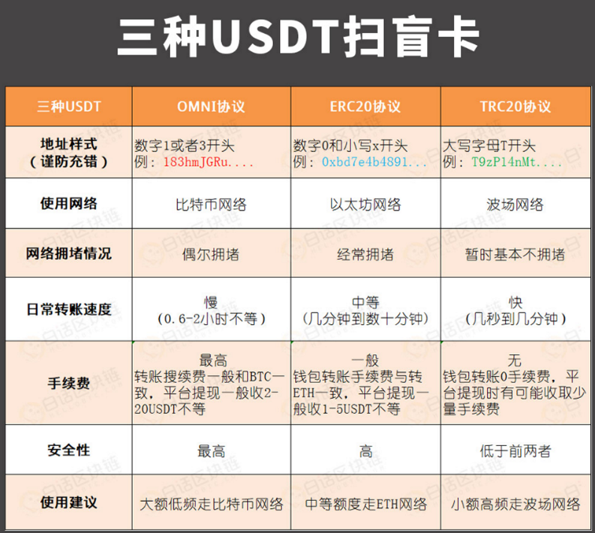

# Blockchains
[Wikipedia](https://en.wikipedia.org/wiki/Blockchain)

## Networks
- Bitcoin
  - OMNI
- Ethereum
  - ERC20
- Tron
  - TRC20
- Atom

[【ERC-20 V.S TRC-20】ERC20/TRC20傳輸USDT哪種優勢更高? | 富投玩家](https://bitcoinmale.com/erc20-trc20/)