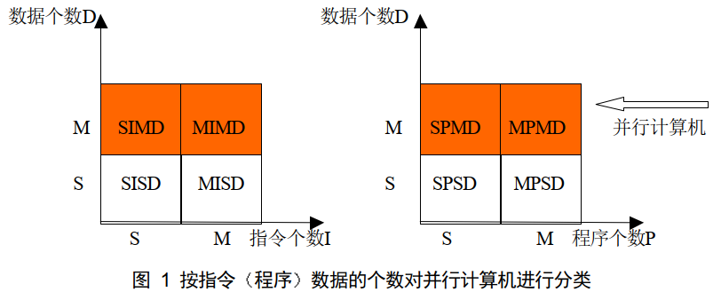

# Parallel Computer Architectures
## 并行计算机的分类

- Single-Instruction Multiple-Data
  
  $A=A+1$

- Multiple-Instruction Multiple-Data
  
  $A=(B+C)+(D-E)+(F\times G)$

- Single-Program Multiple-Data
  
- Multiple-Program Multiple-Data
  
  处理器分工不同

## Flynn's taxonomy
Instrcution stream: A sequence of instructions completed by a processing elements.
Data stream: Data communication between memory and processing elements.

- SISD: tranditional Von Neumann architecture
- MISD: The same data stream flows through a linear array of processors executing different instructions.
- SIMD: With only one control unit, all processors execute the same instructions in a synchronous manner.
- MIMD: Each processor has its own control unit, and can execute different instructions on different data.

## Parallel processors
- SIMD
  - Shared memory
  - Distributed memory
- MIMD
  - Shared memory
    - Parallel vector processors (PVP)
    - Symmetric multi-processors (SMP)
    - Distributed shared processors (DSM)
  - Distributed memory
    - Massively parallel processors (MPP)
    - Cluster of workstation (COW)