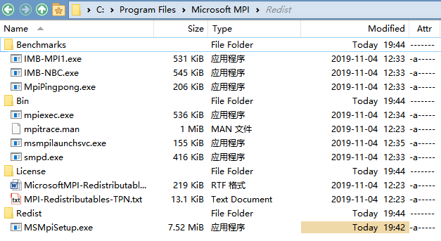
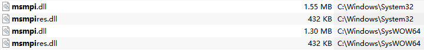

# Message Passing Interface
**Message Passing Interface (MPI)** is a standardized and portable message-passing standard designed to function on parallel computing architectures.

The MPI standard defines the syntax and semantics of library routines that are useful to a wide range of users writing portable message-passing programs in C, C++, and Fortran. There are several open-source MPI implementations, which fostered the development of a parallel software industry, and encouraged development of portable and scalable large-scale parallel applications.[^wiki]

## [MPI Forum](https://www.mpi-forum.org/)
[Issues · mpi-forum/mpi-issues](https://github.com/mpi-forum/mpi-issues/issues)

## Implementations
- MPICH
  
  [MPICH | High-Performance Portable MPI](https://www.mpich.org/)

  [pmodels/mpich: Official MPICH Repository](https://github.com/pmodels/mpich)

- Open MPI
  
  [Open MPI: Open Source High Performance Computing](https://www.open-mpi.org/)

  [open-mpi/ompi: Open MPI main development repository](https://github.com/open-mpi/ompi)

  支持 vcpkg。
  
  官方已经[停止支持 Windows](https://www.open-mpi.org/software/ompi/v1.6/ms-windows.php)，但 [Cygwin](https://cygwin.com/cgi-bin2/package-grep.cgi?grep=openmpi&arch=x86_64) 提供了支持。

- Intel MPI
  
  [Get Started with the Intel® MPI Library for Windows* OS](https://software.intel.com/content/www/us/en/develop/documentation/get-started-with-mpi-for-windows/top.html)

- Microsoft MPI（MS-MPI）
  
  [Microsoft MPI - Message Passing Interface | Microsoft Docs](https://docs.microsoft.com/en-us/message-passing-interface/microsoft-mpi?redirectedfrom=MSDN)

  [microsoft/Microsoft-MPI: Microsoft MPI](https://github.com/Microsoft/Microsoft-MPI)

  支持 vcpkg。
  
  两年没提交了，只支持 MPI 2.2 和部分 MPI 3.1。

[Installing MPI for Windows - Stack Overflow](https://stackoverflow.com/questions/21153750/installing-mpi-for-windows)

### Microsoft MPI




### Boost.MPI
[Chapter 24. Boost.MPI - 1.79.0](https://www.boost.org/doc/libs/1_79_0/doc/html/mpi.html)

2007 年停止维护，只支持到 MPI 1.1。

```cpp
#include <boost/mpi.hpp>
#include <iostream>

int main(int argc, char* argv[])
{
  boost::mpi::environment env(argc, argv);
  boost::mpi::communicator world;

  if (world.rank() == 0) {
    world.send(1, 9, 32);
    world.send(2, 9, 33);
  } else {
    int data;
    world.recv(0, 9, data);
    std::cout << "In process " << world.rank( ) << "with data " << data
                   << std::endl;
    // In process 1 with data 32
    // In process 2 with data 33
  }
  return 0;
}
```
[^boost-ibm]

[^boost-ibm]: [Concurrent programming with Boost using IPC and MPI libraries - IBM Developer](https://developer.ibm.com/articles/au-concurrent_boost/)

## IPC
MPI is a form of IPC.[^ipc-quora] MPI is optimized for efficient, low-latency communication on reliable networks.

Thrift, ProtoBuf, JSON are slow serialization formats that exist primarily for portability and compactness and not for computational efficiency or low latency. You would lose a lot of performance using those for many parallel codes.[^ipc-hacker]

[^ipc-quora]: [What's the difference between IPC and MPI conceptually and implementation? - Quora](https://www.quora.com/Whats-the-difference-between-IPC-and-MPI-conceptually-and-implementation)
[^ipc-hacker]: [Heterogeneous Parallel Programming | Hacker News](https://news.ycombinator.com/item?id=4500158)


[^wiki]: [Message Passing Interface - Wikipedia](https://en.wikipedia.org/wiki/Message_Passing_Interface)